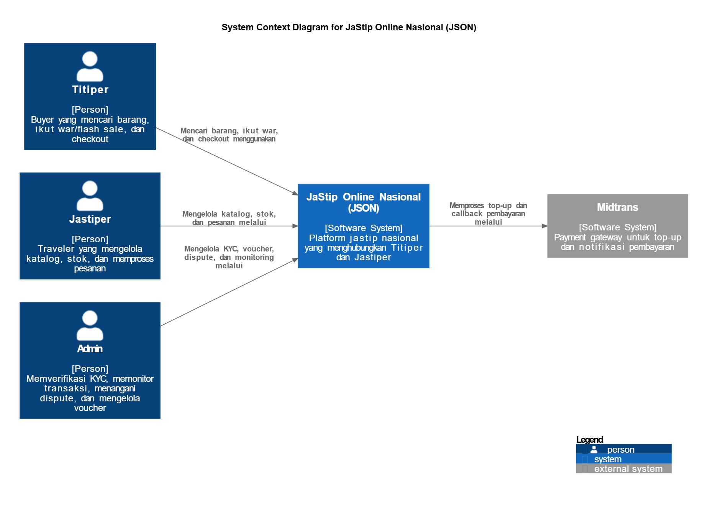
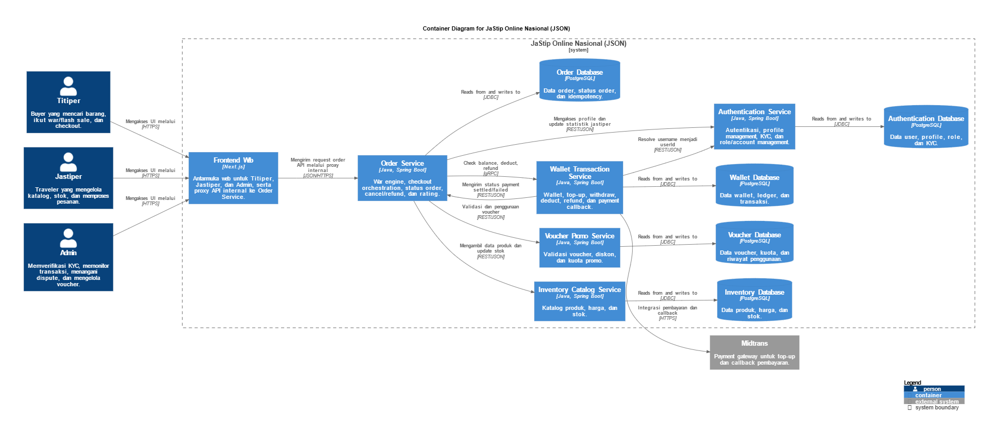
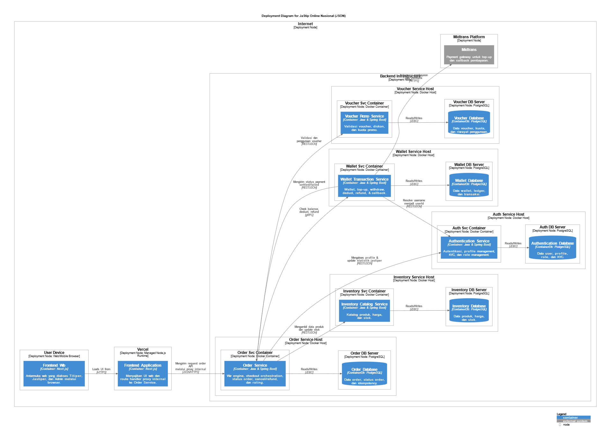
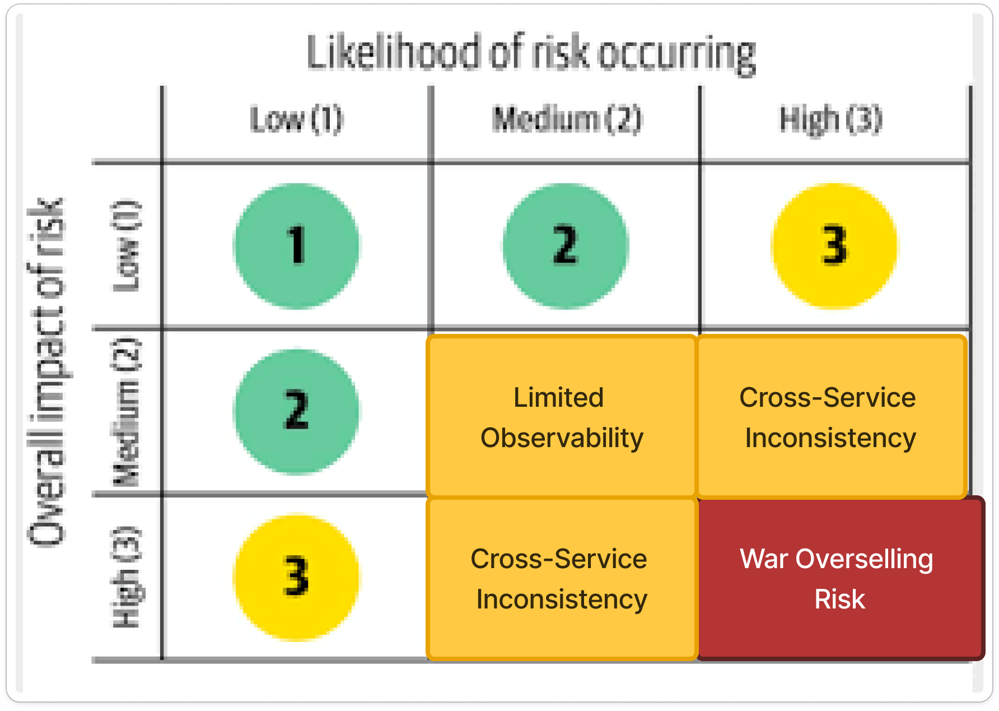
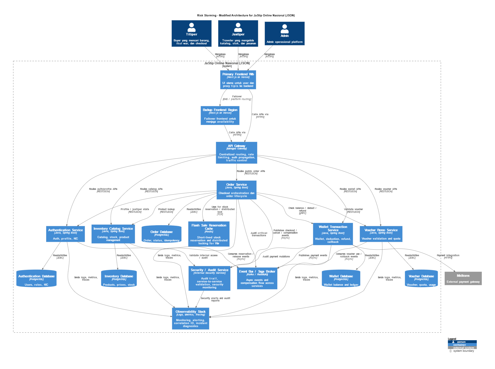

# C4 Model of the Current Architecture

## Context Diagram



## Container Diagram



## Deployment Diagram



## Risk Analysis & Architecture Modification




### Refleksi Risk Storming

Risk Storming diterapkan karena arsitektur saat ini tidak lagi cukup dinilai hanya dari sisi kelengkapan fitur, tetapi juga harus dilihat dari sisi risiko operasional jangka panjang. Ketika JSON berkembang dan digunakan dalam skala yang lebih besar, perhatian utama arsitektur bergeser ke aspek skalabilitas, konsistensi data, ketahanan sistem, dan observability pada banyak service yang saling terhubung.

Teknik ini membantu tim mengidentifikasi risiko secara sistematis berdasarkan kemungkinan terjadinya dan besar dampaknya, bukan hanya berdasarkan intuisi. Dengan memetakan risiko seperti overselling saat war, inkonsistensi antarservice, bottleneck pada Order Service, dan keterbatasan observability ke dalam matriks likelihood-impact, tim dapat memprioritaskan masalah yang paling penting untuk keberlanjutan sistem.

Risk Storming juga bermanfaat karena menghubungkan diskusi arsitektur dengan keputusan desain yang konkret. Hasil akhirnya bukan hanya daftar risiko, tetapi juga usulan future architecture yang lebih jelas, termasuk penambahan API Gateway, reservation cache untuk kontrol flash sale, event bus untuk menjaga konsistensi berbasis saga, serta dukungan observability dan audit yang lebih kuat.

# Individu (Derrick)

## Code Diagram


## Profiling


## Monitoring


# BE Order
PIC: Derrick - 2406351440

Backend service untuk orkestrasi transaksi order pada sistem JaStip Online Nasional (JSON): checkout, lifecycle status order, cancel + refund trigger, rating submission, history/monitoring, serta integrasi lintas service (inventory, wallet, voucher, profile).

## API Documentation
Saat aplikasi berjalan:

- Swagger UI: `http://localhost:5002/swagger-ui/index.html` (profile `dev`)
- OpenAPI JSON: `http://localhost:5002/v3/api-docs` (profile `dev`)

Untuk profile `main`, ganti port menjadi `5000`.

`Authorize` di Swagger menggunakan format:

```text
Bearer <JWT_TOKEN>
```

## Endpoint Summary
Base path: `/api/orders`

- `POST /api/orders/checkout`
- `GET /api/orders`
- `GET /api/orders/{id}`
- `PATCH /api/orders/{id}/status`
- `POST /api/orders/{id}/cancel`
- `POST /api/orders/{id}/rating`
- `GET /api/orders/titiper/{userId}/active`
- `GET /api/orders/titiper/{userId}/history`
- `GET /api/orders/jastiper/{jastiperId}/todo`
- `GET /api/orders/jastiper/{jastiperId}/processing`
- `GET /api/orders/jastiper/{jastiperId}/completed`
- `GET /api/orders/admin/active`
- `GET /api/orders/admin/active/paged`
- `GET /api/orders/admin/by-status`
- `GET /api/orders/admin/by-status/paged`
- `GET /api/orders/admin/summary`

## External Contract Integration
Service ini memakai HTTP integration ke modul lain:

- Inventory: `${ORDER_INVENTORY_URL}`
- Wallet Contract API: `${ORDER_WALLET_URL}`
  - `POST /check-balance`
  - `POST /deduct`
  - `POST /refund`
- Voucher API: `${ORDER_VOUCHER_URL}`
  - `POST /validate`
  - `POST /use`
- Profile: `${ORDER_PROFILE_URL}`

## Database & Migration
- DB: PostgreSQL
- ORM validation mode: `spring.jpa.hibernate.ddl-auto=validate`
- Migration: Flyway (`src/main/resources/db/migration`)
  - `V1__init_order_schema.sql`
  - `V2__add_owner_status_indexes.sql`
  - `V3__add_idempotency_order_fk.sql`

## Configuration
Copy `env.example` menjadi `.env`, lalu isi value sesuai environment.

Variabel utama:

- `ORDER_APP_PORT`
- `POSTGRES_HOST`
- `POSTGRES_PORT`
- `POSTGRES_DB`
- `POSTGRES_DB_DEV`
- `POSTGRES_USER`
- `POSTGRES_PASSWORD`
- `ORDER_INVENTORY_URL`
- `ORDER_WALLET_URL`
- `ORDER_WALLET_INTERNAL_AUTHORIZATION`
- `ORDER_VOUCHER_URL`
- `ORDER_PROFILE_URL`
- `ORDER_PROFILE_INTERNAL_AUTHORIZATION`

## Run with Docker Compose
Menjalankan app + PostgreSQL untuk local testing dengan profile:

- `main` profile:
  - App: `5000`
  - Postgres: `5001`
- `dev` profile:
  - App: `5002`
  - Postgres: `5003`

Jalankan `dev`:

```powershell
docker compose --profile dev up --build
```

Jalankan `main`:

```powershell
docker compose --profile main up --build
```